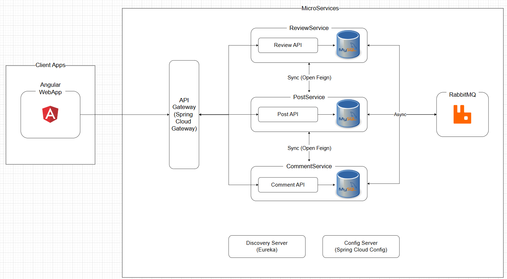

# Architecture

---Architectuur Schema en uitleg communicatie---

Schema:

Uitleg communicatie:

US1: Wanneer er een nieuwe post wordt gemaakt in de PostService, moet er in de andere twee microservices ook een post-instantie worden aangemaakt, zodat de ReviewService deze kan goed- of afkeuren en de CommentService hier commentaar aan kan toevoegen. Dit wordt asynchroon gedaan met RabbitMQ.

US3: Wanneer een post wordt bijgewerkt in de PostService, moeten de ReviewService en CommentService ook de nieuwste gegevens ontvangen. Dit gebeurt asynchroon via RabbitMQ, zodat beide services op de hoogte blijven van updates.

US7: De hoofdredacteur kan een post goed- of afkeuren via de ReviewService. De ReviewService stuurt een bericht naar de PostService om de status van de post bij te werken naar goedgekeurd of afgewezen. Dit gebeurt asynchroon met RabbitMQ, zodat de ReviewService niet hoeft te wachten op een bevestiging. Dit kan vervolgens de meldingslogica activeren voor US8.

US9: Bij het afwijzen van een post kan de hoofdredacteur een opmerking toevoegen, zodat de redacteur weet welke wijzigingen nodig zijn. Dit gebeurt asynchroon via RabbitMQ, waarbij de ReviewService een bericht met de opmerking stuurt naar de PostService.

US10: Wanneer een gebruiker een reactie plaatst op een post via de CommentService, heeft de CommentService soms informatie over de post nodig om de actie te voltooien. Omdat deze gegevens direct nodig zijn, wordt OpenFeign gebruikt om synchronisch gegevens op te halen vanuit de PostService.
